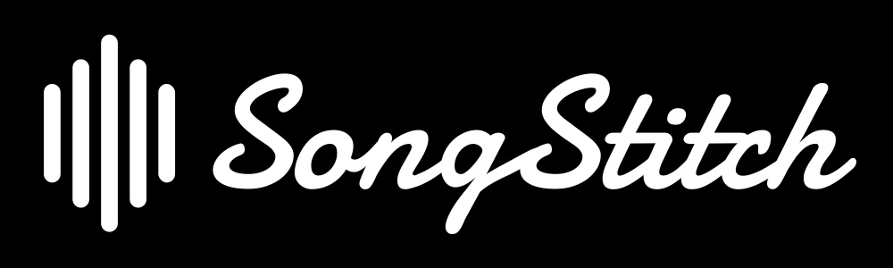

<div align="center">

# SongStitch

</div>

<p align="center">
  
</p>

<div align="center">


[](https://github.com/prettier/prettier)
[](https://apps.apple.com/au/app/songstitch/id6450189672)
[](https://songstitch.art/)
[](https://github.com/SongStitch/song-stitch/actions?query=branch%3Amain)
[](/LICENSE)
[](<[https://github.com/prettier/prettier](https://ko-fi.com/songstitch)>)

</div>

<div align="center">
A <em>blazingly fast</em> web application for generating LastFM collages, written in Go.
</div>

<br/>

<p align="center">
  
</p>

## About

SongStitch is a free, fast and highly customisable [last.fm]("https://last.fm") collage generator that allows you to create personalised collages of your most played albums, artists, and tracks. With SongStitch you can easily generate and share your collages in any size you want, displaying only the information you want, and do so amazingly quickly. Simply go to [songstitch.art](https://songstitch.art) and enter your username to start!

### Customisation Options

- **Collage Type**: Generate collages based off your most played albums, artists, and tracks.
- **Dimensions**: Specify the exact number of rows and columns you would like within your collage.
- **Information**: Choose between adding the album name, artist name and playcount to your collage; or any combo you choose.
- **Text**: Choose the size and style of your text on your collages.

Have a suggestion on how we can make SongStitch better? Feel free to create an issue on [GitHub](https://github.com/SongStitch/song-stitch/issues/new), or submit a PR!

## Usage

To use SongStitch, simply go to [songstitch.art](songstitch.art) to get started, or you can download the free App for iOS on the [App Store](https://apps.apple.com/au/app/songstitch/id6450189672)!

If you would like to run SongStitch yourself, below are the instructions on how you can build and run SongStitch.

### Requirements

There are currently two options to run SongStitch yourself.

1. Build and run the application locally. This requires you to have the `go` and `npm` installed, and the [WebP](https://developers.google.com/speed/webp/) library.

2. Run the application inside the docker container. This requires `docker` to be installed.

### Setup

1. Clone the repository

```shell
git clone git@github.com:SongStitch/song-stitch.git
```

2. Create an API key for [last.fm](https://www.last.fm/api).

3. Add environment variables to a `.env` file in the root directory. The `.env.example` includes everything that the application requires.

4. Run the application with either `make run` to run it on your machine, or `make docker-run` to run it in a container. This will start the application on port `8080`.

5. Go to `localhost:8080` and enjoy!

## iOS Application

There is also the free, [open source](https://github.com/SongStitch/songstitch-ios) SongStitch iOS app for creating collages on your phone to save and share! You can download it from the [App Store](https://apps.apple.com/au/app/songstitch/id6450189672).

## Contributors

- [TheDen](https://github.com/TheDen)
- [BradLewis](https://github.com/BradLewis)
- [Meena Tharmarajah](https://www.linkedin.com/in/meenatharmarajah/)
